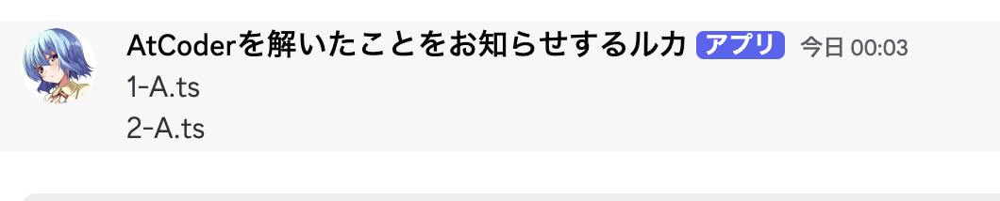

# AtCoderで1日1ACした問題を通知するGHA

## 想定

- AtCoderで解いた問題をGitHubで管理している人
- コミュニティなどで、ゆるーく1日1ACを共有してモチベーションにしたい！ みたいな場面で使う

## 使い方

まず管理者がその人用のWebHookを発行する。
この時、通知botの名前とアイコンを聞いてあげると良い。

僕はルカにしている。

サーバー管理者はリクエストのあった画像と名前でbotを作り、発行したhookURLを共有してあげる。

利用者は、このリポジトリの`notify-streak`を自身の管理するリポジトリの`.github/workflows`に配備し、hookURLを`<change your hooks url>`と置き換える

あとはpush時に、`開催回-問題番号.kt`のような形式が含まれていれば、それを通知してくれる。